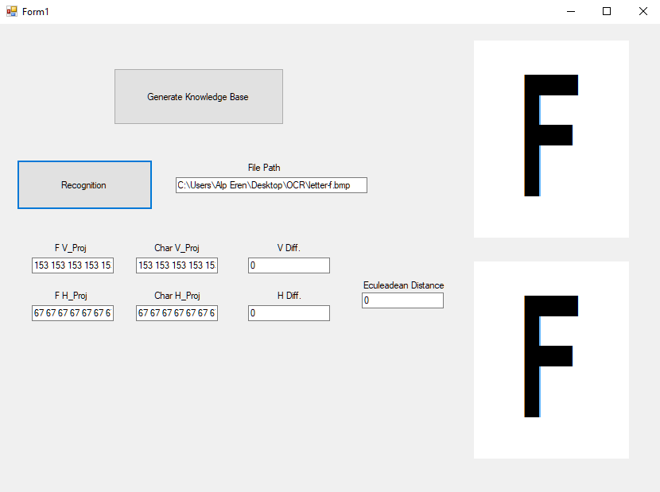
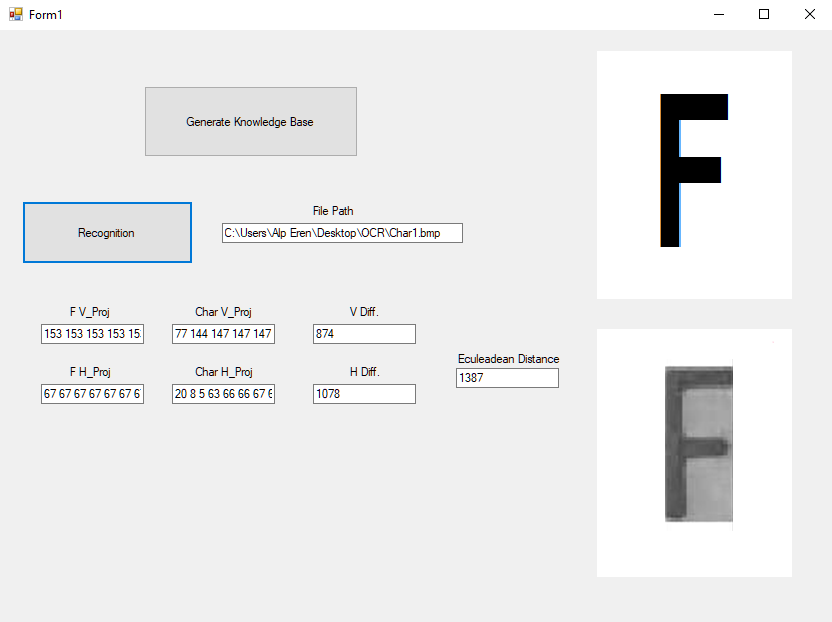
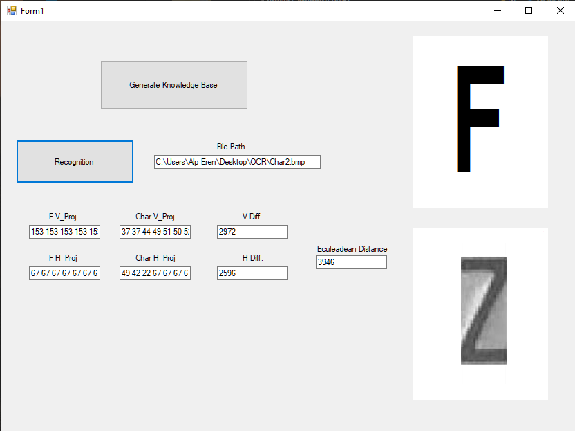

# Optical Character Recognition
OCR software separates the letters on the image, converts them to words, and then builds sentences from the words.
It's just quick solution of detecting letter. Low euclidean distance gives the closest result to the actual letter.

